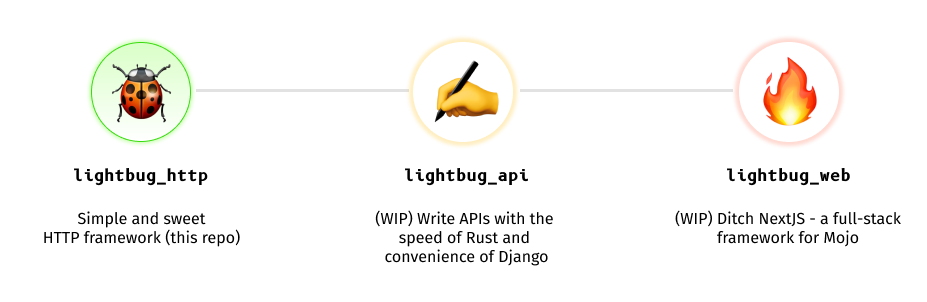

<a name="readme-top"></a>

<!-- PROJECT LOGO -->
<br />
<div align="center">
    

  <h3 align="center">Lightbug</h3>

  <p align="center">
    🐝 A Mojo HTTP framework with wings 🔥
    <br/>

   ![Written in Mojo][language-shield]
   [![MIT License][license-shield]][license-url]
   ![Build status][build-shield]
   <br/>
   [![Join our Discord][discord-shield]][discord-url]
   [![Contributors Welcome][contributors-shield]][contributors-url]
   

  </p>
</div>

## Overview

Lightbug is a simple and sweet HTTP framework for Mojo that builds on best practice from systems programming, such as the Golang [FastHTTP](https://github.com/valyala/fasthttp/) and Rust [may_minihttp](https://github.com/Xudong-Huang/may_minihttp/). 

This is not production ready yet. We're aiming to keep up with new developments in Mojo, but it might take some time to get to a point when this is safe to use in real-world applications.

Lightbug currently has the following features:
 - [x] Pure Mojo! No Python dependencies. Everything is fully typed, with no `def` functions used
 - [x] HTTP Server and Client implementations
 - [x] TCP and UDP support
 - [x] Cookie support

 ### Check Out These Mojo Libraries:

- Logging - [@toasty/stump](https://github.com/thatstoasty/stump)
- CLI and Terminal - [@toasty/prism](https://github.com/thatstoasty/prism), [@toasty/mog](https://github.com/thatstoasty/mog)
- Date/Time - [@mojoto/morrow](https://github.com/mojoto/morrow.mojo) and [@toasty/small-time](https://github.com/thatstoasty/small-time)

<p align="right">(<a href="#readme-top">back to top</a>)</p>

<!-- GETTING STARTED -->
## Getting Started

The only hard dependency for `lightbug_http` is Mojo. 
Learn how to get up and running with Mojo on the [Modular website](https://www.modular.com/max/mojo).
Once you have a Mojo project set up locally,

1. Add the `mojo-community` channel to your `mojoproject.toml`, e.g:

   ```toml
   [project]
   channels = ["conda-forge", "https://conda.modular.com/max", "https://repo.prefix.dev/mojo-community"]
   ```

2. Add `lightbug_http` as a dependency:

   ```toml
   [dependencies]
   lightbug_http = ">=0.1.9"
   ```

3. Run `magic install` at the root of your project, where `mojoproject.toml` is located
4. Lightbug should now be installed as a dependency. You can import all the default imports at once, e.g:

    ```mojo
    from lightbug_http import *
    ```

    or import individual structs and functions, e.g. 

    ```mojo
    from lightbug_http.service import HTTPService
    from lightbug_http.http import HTTPRequest, HTTPResponse, OK, NotFound
    ```

    there are some default handlers you can play with:

    ```mojo
    from lightbug_http.service import Printer # prints request details to console
    from lightbug_http.service import Welcome # serves an HTML file with an image (currently requires manually adding files to static folder, details below)
    from lightbug_http.service import ExampleRouter # serves /, /first, /second, and /echo routes
    ```

5. Add your handler in `lightbug.🔥` by passing a struct that satisfies the following trait:

   ```mojo
   trait HTTPService:
    fn func(mut self, req: HTTPRequest) raises -> HTTPResponse:
        ...
   ```

   For example, to make a `Printer` service that prints some details about the request to console:

   ```mojo
    from lightbug_http.http import HTTPRequest, HTTPResponse, OK
    from lightbug_http.strings import to_string
    from lightbug_http.header import HeaderKey

    @value
    struct Printer(HTTPService):
        fn func(mut self, req: HTTPRequest) raises -> HTTPResponse:
            print("Request URI:", req.uri.request_uri)
            print("Request protocol:", req.protocol)
            print("Request method:", req.method)
            if HeaderKey.CONTENT_TYPE in req.headers:
                print("Request Content-Type:", req.headers[HeaderKey.CONTENT_TYPE])
            if req.body_raw:
                print("Request Body:", to_string(req.body_raw))

            return OK(req.body_raw)
   ```

6. Start a server listening on a port with your service like so.

    ```mojo
    from lightbug_http import Welcome, Server

    fn main() raises:
        var server = Server()
        var handler = Welcome()
        server.listen_and_serve("localhost:8080", handler)
    ```

Feel free to change the settings in `listen_and_serve()` to serve on a particular host and port.

Now send a request `localhost:8080`. You should see some details about the request printed out to the console.

Congrats 🥳 You're using Lightbug!


Routing is not in scope for this library, but you can easily set up routes yourself:

```mojo
from lightbug_http import *

@value
struct ExampleRouter(HTTPService):
    fn func(mut self, req: HTTPRequest) raises -> HTTPResponse:
        var body = req.body_raw
        var uri = req.uri

        if uri.path == "/":
            print("I'm on the index path!")
        if uri.path == "/first":
            print("I'm on /first!")
        elif uri.path == "/second":
            print("I'm on /second!")
        elif uri.path == "/echo":
            print(to_string(body))

        return OK(body)
```

We plan to add more advanced routing functionality in a future library called `lightbug_api`, see [Roadmap](#roadmap) for more details.


<p align="right">(<a href="#readme-top">back to top</a>)</p>

### Serving static files

The default welcome screen shows an example of how to serve files like images or HTML using Lightbug. Mojo has built-in `open`, `read` and `read_bytes` methods that you can use to read files and serve them on a route. Assuming you copy an html file and image from the Lightbug repo into a `static` directory at the root of your repo:

```mojo
from lightbug_http import *

@value
struct Welcome(HTTPService):
    fn func(mut self, req: HTTPRequest) raises -> HTTPResponse:
        var uri = req.uri

        if uri.path == "/":
            var html: Bytes
            with open("static/lightbug_welcome.html", "r") as f:
                html = f.read_bytes()
            return OK(html, "text/html; charset=utf-8")

        if uri.path == "/logo.png":
            var image: Bytes
            with open("static/logo.png", "r") as f:
                image = f.read_bytes()
            return OK(image, "image/png")

        return NotFound(uri.path)
```

### Using the client

Create a file, e.g `client.mojo` with the following code. Run `magic run mojo client.mojo` to execute the request to a given URL.

```mojo
from lightbug_http import *
from lightbug_http.client import Client

fn test_request(mut client: Client) raises -> None:
    var uri = URI.parse("google.com")
    var headers = Headers(Header("Host", "google.com"))
    var request = HTTPRequest(uri, headers)
    var response = client.do(request^)

    # print status code
    print("Response:", response.status_code)

    print(response.headers)

    print(
        "Is connection set to connection-close? ", response.connection_close()
    )

    # print body
    print(to_string(response.body_raw))


fn main() -> None:
    try:
        var client = Client()
        test_request(client)
    except e:
        print(e)
```

Pure Mojo-based client is available by default. This client is also used internally for testing the server.

### UDP Support
To get started with UDP, just use the `listen_udp` and `dial_udp` functions, along with `write_to` and `read_from` methods, like below.

On the client:
```mojo
from lightbug_http.connection import dial_udp
from lightbug_http.address import UDPAddr
from utils import StringSlice

alias test_string = "Hello, lightbug!"

fn main() raises:
    print("Dialing UDP server...")
    alias host = "127.0.0.1"
    alias port = 12000
    var udp = dial_udp(host, port)

    print("Sending " + str(len(test_string)) + " messages to the server...")
    for i in range(len(test_string)):
        _ = udp.write_to(str(test_string[i]).as_bytes(), host, port)

        try:
            response, _, _ = udp.read_from(16)
            print("Response received:", StringSlice(unsafe_from_utf8=response))
        except e:
            if str(e) != str("EOF"):
                raise e

```

On the server:
```mojo
fn main() raises:
    var listener = listen_udp("127.0.0.1", 12000)

    while True:
        response, host, port = listener.read_from(16)
        var message = StringSlice(unsafe_from_utf8=response)
        print("Message received:", message)

        # Response with the same message in uppercase
        _ = listener.write_to(String.upper(message).as_bytes(), host, port)

```

<!-- ROADMAP -->
## Roadmap

<div align="center">
    
</div>

We're working on support for the following (contributors welcome!):

 - [ ] [JSON support](https://github.com/saviorand/lightbug_http/issues/4)
 - [ ] Complete HTTP/1.x support compliant with RFC 9110/9112 specs (see issues)
 - [ ] [SSL/HTTPS support](https://github.com/saviorand/lightbug_http/issues/20)
 - [ ] [Multiple simultaneous connections](https://github.com/saviorand/lightbug_http/issues/5), [parallelization and performance optimizations](https://github.com/saviorand/lightbug_http/issues/6)
 - [ ] [HTTP 2.0/3.0 support](https://github.com/saviorand/lightbug_http/issues/8)

The plan is to get to a feature set similar to Python frameworks like [Starlette](https://github.com/encode/starlette), but with better performance.

Our vision is to develop three libraries, with `lightbug_http` (this repo) as a starting point: 
 - `lightbug_http` - Lightweight and simple HTTP framework, basic networking primitives
 - [`lightbug_api`](https://github.com/saviorand/lightbug_api) - Tools to make great APIs fast, with OpenAPI support and automated docs
 - `lightbug_web` - (release date TBD) Full-stack web framework for Mojo, similar to NextJS or SvelteKit

The idea is to get to a point where the entire codebase of a simple modern web application can be written in Mojo. 

We don't make any promises, though -- this is just a vision, and whether we get there or not depends on many factors, including the support of the community.


See the [open issues](https://github.com/saviorand/lightbug_http/issues) and submit your own to help drive the development of Lightbug.

<p align="right">(<a href="#readme-top">back to top</a>)</p>


<!-- CONTRIBUTING -->
## Contributing

Contributions are what make the open source community such an amazing place to learn, inspire, and create. Any contributions you make are **greatly appreciated**. See [CONTRIBUTING.md](./CONTRIBUTING.md) for more details on how to contribute.

If you have a suggestion that would make this better, please fork the repo and create a pull request. You can also simply open an issue with the tag "enhancement".
Don't forget to give the project a star!

1. Fork the Project
2. Create your Feature Branch (`git checkout -b feature/AmazingFeature`)
3. Commit your Changes (`git commit -m 'Add some AmazingFeature'`)
4. Push to the Branch (`git push origin feature/AmazingFeature`)
5. Open a Pull Request

<p align="right">(<a href="#readme-top">back to top</a>)</p>


<!-- LICENSE -->
## License

Distributed under the MIT License. See `LICENSE.txt` for more information.

<p align="right">(<a href="#readme-top">back to top</a>)</p>


<!-- CONTACT -->
## Contact

[Valentin Erokhin](https://www.valentin.wiki/)

Project Link: [https://github.com/saviorand/mojo-web](https://github.com/saviorand/mojo-web)

<p align="right">(<a href="#readme-top">back to top</a>)</p>


<!-- ACKNOWLEDGMENTS -->
## Acknowledgments

We were drawing a lot on the following projects:

* [FastHTTP](https://github.com/valyala/fasthttp/) (Golang)
* [may_minihttp](https://github.com/Xudong-Huang/may_minihttp/) (Rust)
* [FireTCP](https://github.com/Jensen-holm/FireTCP) (One of the earliest Mojo TCP implementations!)


<p align="right">(<a href="#readme-top">back to top</a>)</p>

## Contributors
Want your name to show up here? See [CONTRIBUTING.md](./CONTRIBUTING.md)!

<a href="https://github.com/saviorand/lightbug_http/graphs/contributors">
  
</a>

<sub>Made with [contrib.rocks](https://contrib.rocks).</sub>

<!-- MARKDOWN LINKS & IMAGES -->
<!-- https://www.markdownguide.org/basic-syntax/#reference-style-links -->
[build-shield]: https://img.shields.io/github/actions/workflow/status/saviorand/lightbug_http/.github%2Fworkflows%2Fpackage.yml
[language-shield]: https://img.shields.io/badge/language-mojo-orange
[license-shield]: https://img.shields.io/github/license/saviorand/lightbug_http?logo=github
[license-url]: https://github.com/saviorand/lightbug_http/blob/main/LICENSE
[contributors-shield]: https://img.shields.io/badge/contributors-welcome!-blue
[contributors-url]: https://github.com/saviorand/lightbug_http#contributing
[discord-shield]: https://img.shields.io/discord/1192127090271719495?style=flat&logo=discord&logoColor=white
[discord-url]: https://discord.gg/VFWETkTgrr
